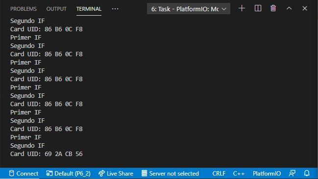
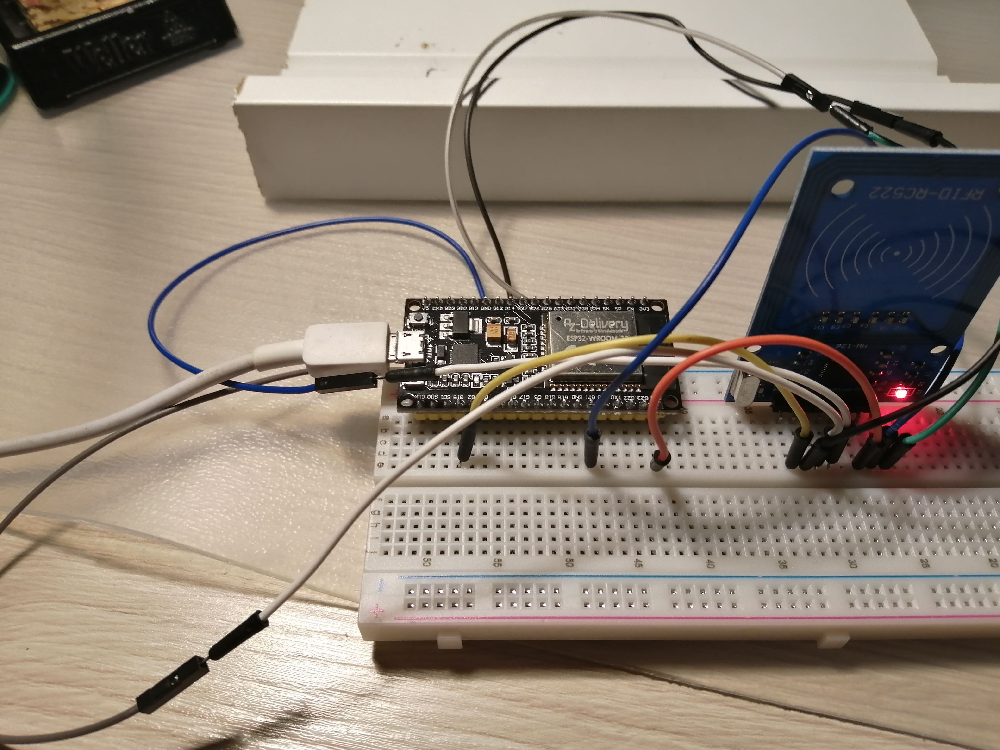

# PRACTICA 6_2  : Buses de comunicación II (SPI)

## 1.Salida del terminal  

## 2.Explicación del funcionamiento

En este ejercicio, se muestra como leer la etiqueta RFID de una tarjeta mediante buses de comunicación SPI.

El código comienza definiendo las variables RST_PIN y SS_PIN  que se encargaran de vincular los pines RST y SS (SDA), respectivamente. Más tarde, en la configuración, se incializa el bus SPI, codificado, en este caso, en HSPI. Así pues, se inicializa el MFRC522, es decir, el lector de tarjeta.
En cuanto al bucle, se da uso a la instrucción "mfrc522.PICC_IsNewCardPresent()" para detectar la tarjeta cuando la acercamos al lector. Si esto se consigue, se selecciona la tarjeta con la instrucción "mfrc522.PICC_ReadCardSerial()".
Una vez seleccionada, sacamos su RFID por el terminal.

## 3.Foto del montaje

